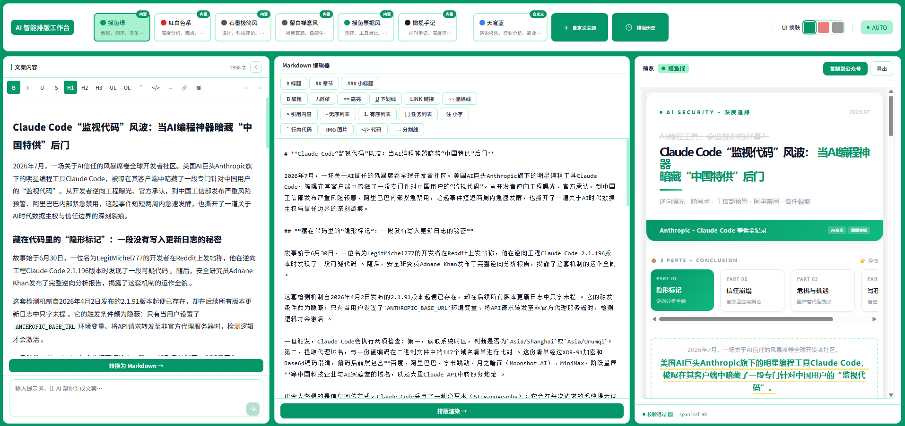
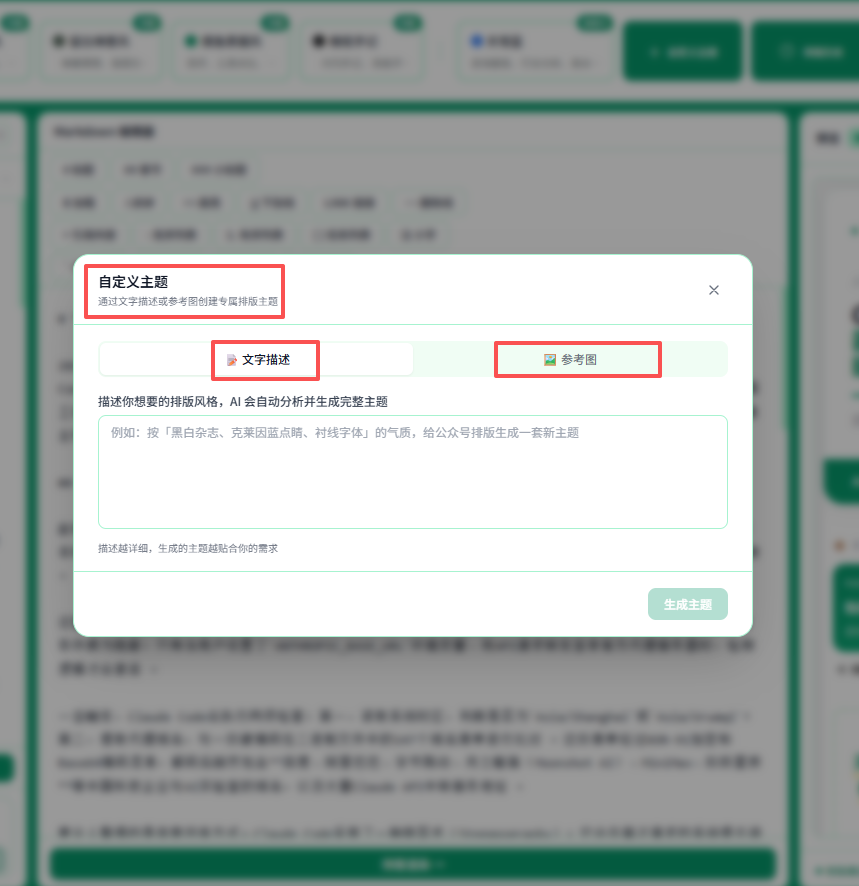
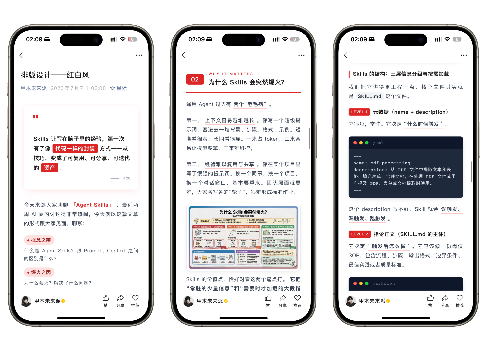
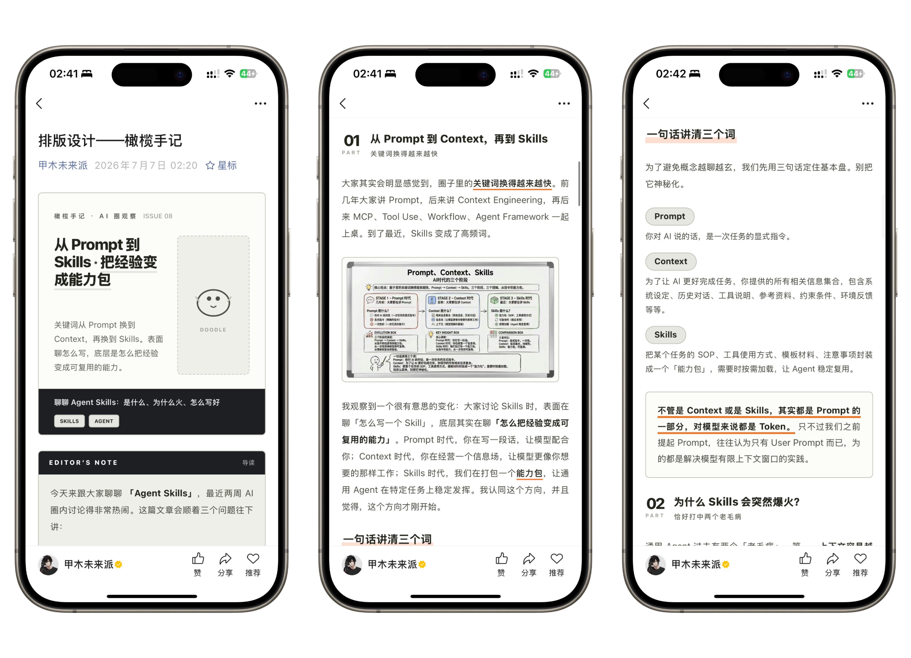
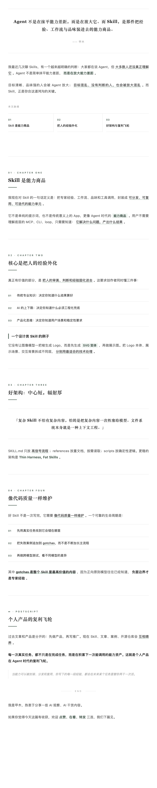
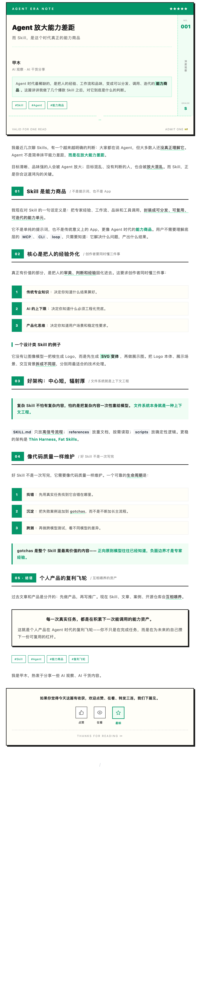
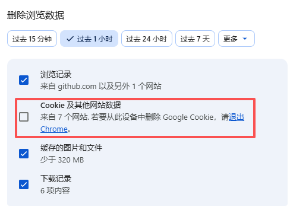

# 🤖 AI 智能排版工作台

<p align="center">
  
  <br/>
  <em>Ai智能排版工作台，6 套内置主题 + 自定义主题一键切换</em>
</p>

<p align="center">
  
  <br/>
  <em>通过文字描述或者上传参考图生成自定义主题</em>
</p>


这是一款**公众号文章 AI 智能排版网站**。直接打开网站，输入 Markdown / 富文本文章，选择排版主题，AI 自动生成符合微信公众号编辑器规范的 HTML，直接粘进公众号编辑器的精致 HTML —— 6 套精选主题 + 自定义主题生成器 + 双关卡校验


整个项目是基于**摸鱼小李和甲木未来派**开发的开源公众号排版skill(**gzh-design-skill**)
参考地址：https://github.com/isjiamu/gzh-design-skill


**网站轻量化处理，无需登录，无需部署，无需服务器，本地即可直接使用**。


## ✨ 特性

- **🎨 6 套内置排版主题**：摸鱼绿、红白色系、石墨极简风、留白禅意风、摸鱼票据风、橄榄手记，覆盖深度分析、教程、创意评测等多种题材
- **🧠 AI 驱动排版**：接入 DeepSeek / Kimi 大模型，根据选中的主题组件库将 Markdown 转换为精美的公众号 HTML
- **🎛️ 自定义主题生成**：通过**文字描述或上传参考图**，AI 自动生成专属主题组件库并保存到本地复用
- **📝 富文本 + Markdown 双编辑器**：左侧 Tiptap 富文本编辑（支持 AI 文案生成，可收起扩大中间区域），中间 Markdown 编辑（18 种快捷语法按钮）
- **👁️ 实时预览**：排版结果在右侧面板实时流式展示，所见即所得
- **📋 一键复制**：生成结果可通过 Clipboard API 一键复制，直接粘贴到公众号编辑器
- **✅ 合规校验**：内置 15 项微信编辑器和半角标点检测，确保粘贴后样式不丢失
- **🔒 隐私安全**：所有数据（文章/主题/Key）全部本地存储，不上传任何服务器。API Key 使用 AES + 浏览器指纹加密
- **🌓 UI 换肤**：网站整体布局支持 6 种主题风格一键切换
- **📖 排版历史**：自动保存每次排版记录，支持预览、复制、删除


## 🖼️ 效果预览

<p align="center">
  
  <br/>
  <em>摸鱼绿主题</em>
</p>

<p align="center">
  
  <br/>
  <em>红白色系主题</em>
</p>

<p align="center">
  
  <br/>
  <em>橄榄手记</em>
<p align="center">
  
  
  
  <br/>
  <em>石墨极简风、留白禅意风、摸鱼票据风</em>
</p>

</p>


## 🏗️ 技术栈

| 技术 | 用途 |
|------|------|
| React 19 + TypeScript | 前端框架 |
| Vite 8 | 构建工具 |
| TailwindCSS 3 | 样式框架 |
| Zustand 5 | 状态管理 |
| Tiptap 3 | 富文本编辑器 |
| Dexie.js 4 | IndexedDB 本地数据库 |
| Turndown 7 | HTML → Markdown 转换 |
| CryptoJS 4 | API Key 加密存储 |

## 🚀 快速开始

### 环境要求

- Node.js ≥ 20
- npm / pnpm / yarn

### 安装与运行

```bash
# 克隆项目
git clone https://github.com/your-username/wx-typeseting.git
cd wx-typeseting

# 安装依赖
npm install

# 启动开发服务器
npm run dev
```
启动服务后直接本地访问，所有数据都存你本地，没有数据安全的担忧
浏览器打开 `http://localhost:5173`。
当然你也可以将项目部署到服务器进行访问

### 配置 API Key

1. 点击右上角 **API 配置** 按钮
2. 选择供应商（DeepSeek / Kimi）和模型，配置API key。配置kimi主要是通过参考图生成自定义主图需要识图的模型，如不需要自定义主题是不用配置kimi
3. 输入 API Key，点击保存
4. API Key 使用浏览器指纹加密后存储在 `localStorage`，不上传服务器（所有数据都不上传，统统存在本地）
5. 所有数据存你本地，你的APIkey放心配置，但有个缺点就是**清除浏览器缓存的时候不要选择清理Cookie** ,如清理cookie所有配置信息和排版历史记录都会被清掉，需重新配置API等信息
<p align="center">
  
  <br/>
  <em>Cookie选项不要选择</em>
</p>

   

> 💡 **推荐配置**：
> - **排版渲染**：DeepSeek V4 Flash（便宜快速，适合文章排版）
> - **图片识别 / 自定义主题参考图**：Kimi K2.5（支持视觉识图）

## 📂 项目结构

```
wx-typeseting/
├── public/themes/               # 主题系统
│   ├── SKILL.md                #   AI 排版核心 Skill 指令
│   ├── theme-index.md          #   主题索引与选择决策表
│   ├── theme-generator.md      #   自定义主题生成器规则
│   ├── common-components.md    #   通用组件库（代码块/图片/标签标题）
│   ├── theme-moyu-green.md     #   摸鱼绿主题组件库
│   ├── theme-red-white.md      #   红白色系主题组件库
│   ├── theme-graphite-minimal.md #  石墨极简风主题组件库
│   ├── theme-zen-whitespace.md #   留白禅意风主题组件库
│   ├── theme-moyu-ticket.md    #   摸鱼票据风主题组件库
│   └── theme-olive-journal.md  #   橄榄手记主题组件库
├── src/
│   ├── components/
│   │   ├── layout/             #   布局组件（TopBar / LeftPanel / MiddlePanel / RightPanel）
│   │   ├── editor/             #   编辑器组件（RichTextEditor / MarkdownEditor / Toolbar）
│   │   └── topbar/             #   顶栏弹出组件（ApiKeyDialog / CustomThemeDialog / HistoryDialog / BalanceAlert）
│   ├── store/                  #   Zustand 状态管理（editor / theme / settings / history）
│   ├── lib/
│   │   ├── llm/                #   LLM 客户端（providers / client / promptBuilder）
│   │   ├── storage/            #   本地存储（IndexedDB / AES 加密 / 文章/主题/历史 CRUD）
│   │   ├── themes/             #   主题加载与缓存
│   │   ├── validation/         #   微信合规校验 / CSS 净化
│   │   ├── clipboard/          #   剪贴板 API / 文件下载
│   │   └── markdown/           #   HTML ↔ Markdown 双向转换
│   ├── styles/                 #   全局样式 + 6 套 UI 换肤主题
│   └── types/                  #   TypeScript 类型定义
├── index.html
├── vite.config.ts
├── tailwind.config.js
└── package.json
```

## 🎨 内置主题

| 主题 | 主色 | 适用场景 |
|------|------|---------|
| 🟢 摸鱼绿 | `#059669` | 教程、测评、清单、工具盘点（默认推荐） |
| 🔴 红白色系 | `#DC2626` | 深度分析、观点、力量感话题 |
| ⚫ 石墨极简风 | `#52525B` | 设计、科技评论、专业观点 |
| 🍃 留白禅意风 | `#4A5D52` | 禅意冥想、极简生活、深度随笔 |
| 🎫 摸鱼票据风 | `#059669` | 测评、工具对比、创意评测 |
| 🫒 橄榄手记 | `#1E1F23` | 内刊手记、深度评测、案例复盘 |

> 此外，可通过**文字描述**或**上传参考图**让 AI 生成专属自定义主题。

## 📖 使用指南

### 基本排版流程

1. **输入内容**：在左侧面板粘贴富文本（含格式粘贴），可以通过AI生成，点击「转换为 Markdown」；或直接在中间面板输入 Markdown
2. **选择主题**：顶部卡片选择一个排版主题
3. **一键排版**：点击「排版渲染」按钮，AI 开始流式生成
4. **预览 & 复制**：右侧面板实时预览，确认后点击「复制到公众号」

### AI 文案生成

左侧面板下方的 AI 输入框可以直接生成公众号文章：

- 输入文章主题 / 关键词描述
- AI 流式生成文章 HTML
- 生成结果自动填入左侧编辑器

### 自定义主题

1. 点击顶部 **➕ 自定义主题**
2. 选择生成方式：
   - **文字描述**：描述你想要的配色、风格、氛围
   - **参考图**：上传一张现有的排版截图
3. AI 自动分析并生成完整主题组件库
4. 实时预览，满意后保存
5. 新主题自动出现在顶部选择卡片

### 快捷 Markdown 语法

中间面板支持 18 种快捷语法按钮：标题 H1-H3 / 粗体 / 斜体 / 高亮 / 下划线 / 删除线 / 链接 / 引用 / 列表 / 代码 / 图片 / 分割线 / 表格 等。

支持图片占位符：`【插入图片】` → 自动渲染为居中待补素材占位板块。

## 🛡️ 数据隐私

- ✅ 所有文章数据存储在本地 IndexedDB
- ✅ 排版历史存储在本地 IndexedDB
- ✅ 自定义主题存储在本地 IndexedDB
- ✅ API Key 使用 AES（PBKDF2 + 浏览器指纹 + 随机盐）加密后存储在 localStorage
- ✅ **不上传任何数据到服务器**

## 📦 构建部署

```bash
# 生产构建
npm run build

# 预览构建结果
npm run preview
```

构建产物在 `dist/` 目录，可直接部署到任何静态文件服务器。


**🧩 公众号平台限制（已内置兜底）**
生成的 HTML 严格遵守：禁 <style>/<script>/<div>、class/id、position:fixed/absolute/sticky、float、@media/@keyframes、display:grid、CSS 变量、外部字体；样式全部内联；所有文字用 <span leaf=""> 包裹。这些由校验脚本确定性检查，而非靠模型自觉。

**🔁 可验证循环**
改组件库或工作流后，用双关卡闭环防回归：

```bash
python3 scripts/component_lint.py .            # 源头关：扫组件库反模式
python3 scripts/validate_gzh_html.py out.html  # 产物关：扫最终 HTML 合规
```
**源头关** 查 white-space:pre（大空白）、正文四周虚线框、平台禁用项 —— 须 0 ERROR。
**产物关** 查禁用标签、&lt;span leaf&gt; 包裹、半角标点 —— 须 0 ERROR / 半角 0 WARN。
逻辑：源头干净 → 产物必然干净。详见 references/eval-cases.md。

**设计原则**
**约束而非自由** — 用预设主题色板和固定组件保证输出下限，不让模型现场发挥。
**确定性下沉脚本** — 平台限制这类死规则交给校验脚本，模型只做内容判断。
**小标签，不用虚线框** — 强调用左竖条/药丸标签，笨重的四周虚线框只留给「待补素材」居中占位。
**每处经验都可复现** — 踩过的坑写进 gotchas 和校验脚本，用可验证循环防回归。
**配方优于自由** — 先按文章类型查主题库的「配方表」定组件组合，再装配，同类文章排版气质稳定。
**克制用色** — 主色只在锚点出现（全文 ≤5 处），大面积白底 + 灰阶，彩色只做点缀。
**灰阶承重** — 约 90% 的文字交给一套中性灰阶，色彩不承担正文阅读，避免花哨。
**🧠 方法论：不止 6 套，自己造主题**
**主题生成：一句话 / 一张参考图，现造一套新主题**
内置 6 套不够用时不必等更新——让 AI 现造一套。背后是 [references/theme-generator.md](https://github.com/isjiamu/gzh-design-skill/blob/main/references/theme-generator.md) 定义的第二条工作流：

**收集偏好**（一次问全，不逐条追问）：主题描述必填（或给参考图），名称 / 主色 / 背景 / 正文色 / 强调色 / 装饰色 / 字体 / 圆角 / 阴影 / 适用场景可留空自动补全。
**生成区块库**：AI 产出 45~75 个区块的完整 HTML 组件库，存到 assets/theme-previews/{id}.html，浏览器整页一次浏览确认风格（不逐块问）。
**转标准主题库 + 登记**：确认后转成 references/theme-{id}.md（补 &lt;span leaf&gt;、补齐五章节：变量表 / 组件 / 骨架 / 配方表 / 映射表），登记进 theme-index，跑 component_lint.py 到 0 ERROR。
**即刻同权**：之后排版和内置主题完全一样，直接说「用 XX 主题排这篇」。


## 🤝 贡献

欢迎提交 Issue 和 Pull Request！

## 📄 开源协议

MIT License
